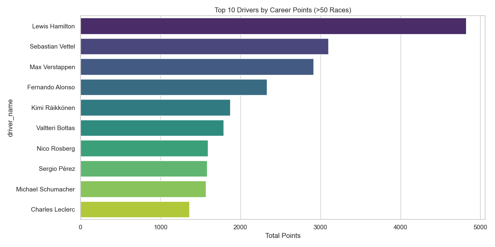
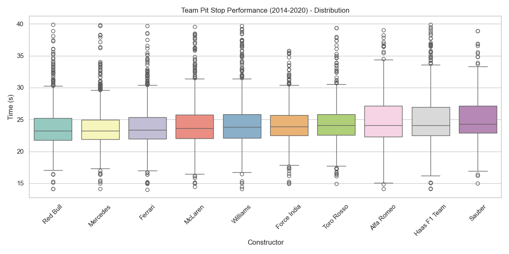
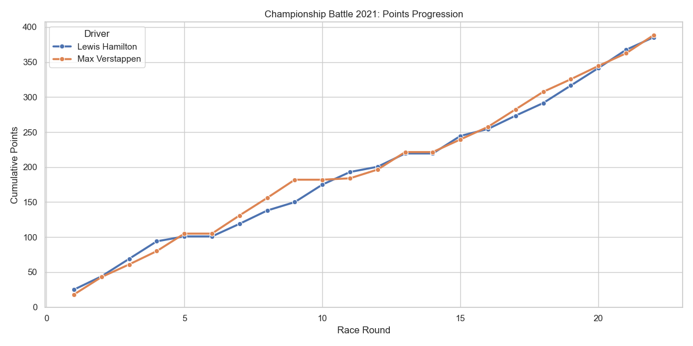
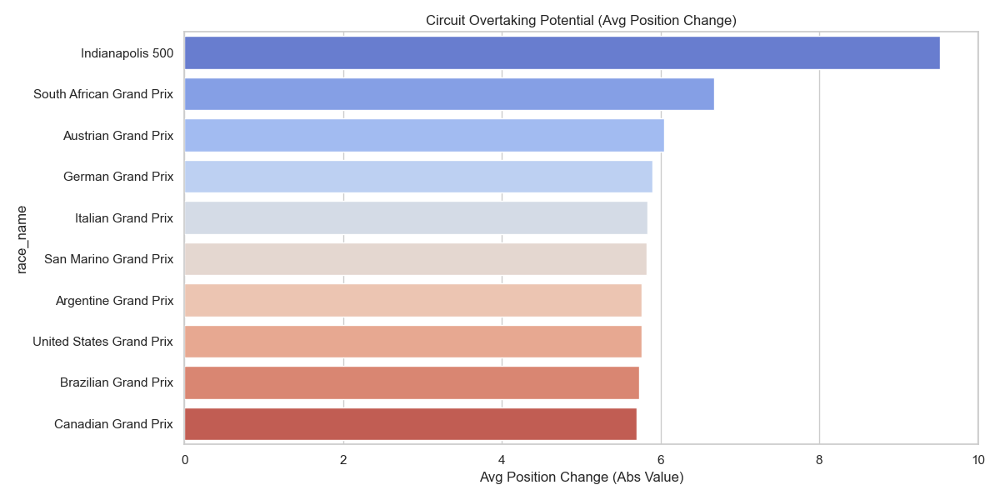

# F1 Championship Intelligence Analytics

A comprehensive analytics project analyzing Formula 1 World Championship data (1950-2020) using Python, Jupyter notebooks, and an interactive Streamlit dashboard. This project delivers insights into driver performance, race strategy, pit stop efficiency, and championship dynamics.

## Project Overview

This portfolio project demonstrates end-to-end data analytics capabilities including:
- Data cleaning and transformation
- Exploratory data analysis (EDA)
- Statistical modeling and performance metrics
- Interactive visualizations
- Business intelligence reporting
- Dashboard development

## Key Features

### Analytics Capabilities
- **Driver Performance Analysis**: Career statistics, consistency metrics, win efficiency
- **Strategy Intelligence**: Pit stop performance, circuit overtaking potential, lap pace trends
- **Championship Dynamics**: Points progression tracking, battle visualization
- **Lap Time Trends**: Tire degradation analysis, stint pace comparison

### Deliverables
- Clean, structured datasets
- Jupyter notebooks with detailed analysis
- Intelligence reports with key findings
- Interactive Streamlit dashboard
- Professional visualizations

## Project Structure

```
f1-championship-analytics/
├── data/                          # Cleaned datasets
│   ├── clean_lap_times.csv
│   ├── clean_pit_stops.csv
│   └── clean_results.csv
├── notebooks/                     # Analysis notebooks
│   ├── data_prep.ipynb
│   ├── driver_analytics.ipynb
│   └── strategy_analytics.ipynb
├── dashboard/                     # Streamlit application
│   ├── Home.py
│   └── pages/
│       ├── 1_Driver_Performance.py
│       ├── 2_Strategy_Analytics.py
│       ├── 3_Championship_Dynamics.py
│       └── 4_Lap_Time_Trends.py
├── reports/                       # Intelligence reports
│   ├── driver_intelligence_report.md
│   └── strategy_intelligence_report.md
├── images/                        # Visualizations
│   ├── championship_battle_2021.png
│   ├── circuit_overtaking_rank.png
│   ├── driver_consistency_boxplot.png
│   ├── lap_pace_trace_2021.png
│   ├── team_pit_performance.png
│   ├── top_10_drivers_points.png
│   ├── top_10_podium_rate.png
│   └── win_vs_dnf_scatter.png
├── scripts/                       # Standalone analysis scripts
│   ├── data_prep.py
│   ├── driver_analytics.py
│   └── strategy_analytics.py
├── utils.py                       # Utility functions
├── SCHEMA.md                      # Data schema documentation
├── requirements.txt               # Python dependencies
└── README.md                      # This file
```

## Getting Started

### Prerequisites
- Python 3.8 or higher
- pip package manager

### Installation

1. **Clone the repository**
```bash
git clone https://github.com/yourusername/Formula1.git
cd Formula1
```

2. **Install dependencies**
```bash
pip install -r requirements.txt
```

### Required Libraries
- `pandas` - Data manipulation and analysis
- `numpy` - Numerical computing
- `matplotlib` - Static visualizations
- `seaborn` - Statistical data visualization
- `plotly` - Interactive charts
- `streamlit` - Dashboard framework
- `scikit-learn` - Machine learning utilities
- `kagglehub` - Dataset acquisition

## Usage

### Running the Dashboard

Launch the interactive Streamlit dashboard:

```bash
streamlit run dashboard/Home.py
```

The dashboard will open in your default browser at `http://localhost:8501`

#### Dashboard Navigation

The dashboard consists of multiple pages accessible from the sidebar:

1. **Home**: Project overview and navigation guide
2. **Driver Performance**: Analyze driver statistics, consistency, and career achievements
3. **Strategy Analytics**: Explore pit stop efficiency and circuit characteristics
4. **Championship Dynamics**: Track championship battles and points progression
5. **Lap Time Trends**: Examine lap pace evolution and tire strategy impact

### Running Notebooks

Navigate to the `notebooks/` directory and launch Jupyter:

```bash
jupyter notebook
```

Open any notebook to explore:
- `data_prep.ipynb` - Data cleaning and preprocessing
- `driver_analytics.ipynb` - Driver performance analysis
- `strategy_analytics.ipynb` - Race strategy insights

### Running Standalone Scripts

Execute individual analysis scripts:

```bash
python scripts/driver_analytics.py
python scripts/strategy_analytics.py
```

## Key Insights

### Driver Performance


**Top Career Performers (>50 races)**:
- **Lewis Hamilton**: 4,820.5 points across 356 races (105 wins)
- **Sebastian Vettel**: 3,098.0 points across 300 races (53 wins)
- **Max Verstappen**: 2,912.5 points across 209 races (63 wins)

### Pit Stop Excellence


**Fastest Average Pit Stops (2014-2020)**:
- Red Bull consistently achieves sub-2.3 second pit stops
- Mercedes and McLaren maintain competitive 2.3-2.5 second averages

### Championship Battles


The 2021 season showcased one of the tightest championship battles in F1 history, with the points gap fluctuating throughout the season.

### Circuit Intelligence


Circuits ranked by position change variance reveal strategic overtaking opportunities, crucial for race strategy planning.

## Data Schema

The project uses Formula 1 World Championship data spanning 1950-2020. For detailed information about table relationships and field definitions, see [SCHEMA.md](SCHEMA.md).

**Core Tables**:
- `results` - Race results and driver performance
- `lap_times` - Lap-by-lap timing data
- `pit_stops` - Pit stop durations and timing
- `drivers` - Driver information
- `constructors` - Team/constructor data
- `races` - Race metadata and circuits

## Technical Stack

- **Language**: Python 3.8+
- **Data Processing**: pandas, numpy
- **Visualization**: matplotlib, seaborn, plotly
- **Dashboard**: Streamlit
- **Analysis**: Jupyter notebooks
- **Version Control**: Git/GitHub

## Reports

Detailed intelligence reports are available in the `reports/` directory:

- [Driver Intelligence Report](reports/driver_intelligence_report.md) - Comprehensive driver performance analysis
- [Strategy Intelligence Report](reports/strategy_intelligence_report.md) - Race strategy and pit stop insights

## Skills Demonstrated

- Data cleaning and preprocessing
- Exploratory data analysis (EDA)
- Statistical analysis and metrics calculation
- Data visualization and storytelling
- Interactive dashboard development
- Business intelligence reporting
- Git version control
- Documentation and presentation

## Future Enhancements

**Version 2.0 Roadmap**:
- [ ] Predictive modeling for race outcomes
- [ ] Real-time data integration via F1 API
- [ ] Machine learning for pit stop strategy optimization
- [ ] Weather impact analysis
- [ ] Driver vs. car performance decomposition
- [ ] Deployment to cloud platform (Streamlit Cloud / Heroku)

## Contact

**Portfolio Project**: Formula 1 Championship Intelligence Analytics  
**Version**: 1.0 (Analytics)  
**Author**: [Your Name]  
**LinkedIn**: [Your LinkedIn Profile]  
**GitHub**: [Your GitHub Profile]

## Acknowledgments

- Data source: Formula 1 World Championship dataset (1950-2020)
- Kaggle for dataset hosting
- F1 community for domain insights

## License

This project is open source and available for educational and portfolio purposes.

---

**If you found this project interesting, please consider giving it a star!**

*Last Updated: February 2026*
