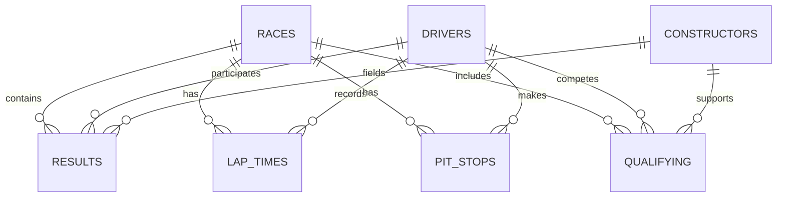

# F1 Data Schema

This document outlines the relationships between the tables in the Formula 1 World Championship dataset.

## Core Tables

### `races`
Contains information about each race event.
- **Primary Key**: `raceId`
- **Foreign Keys**: `circuitId` -> `circuits.circuitId`

### `drivers`
Contains information about each driver.
- **Primary Key**: `driverId`

### `constructors`
Contains information about each constructor (team).
- **Primary Key**: `constructorId`

## Performance Tables

### `results`
The central table linking drivers, constructors, and races with race results.
- **Foreign Keys**:
  - `raceId` -> `races.raceId`
  - `driverId` -> `drivers.driverId`
  - `constructorId` -> `constructors.constructorId`

### `lap_times`
Lap-by-lap timing for each driver in each race.
- **Foreign Keys**:
  - `raceId` -> `races.raceId`
  - `driverId` -> `drivers.driverId`

### `pit_stops`
Pit stop data for each driver in each race.
- **Foreign Keys**:
  - `raceId` -> `races.raceId`
  - `driverId` -> `drivers.driverId`

### `qualifying`
Qualifying session results.
- **Foreign Keys**:
  - `raceId` -> `races.raceId`
  - `driverId` -> `drivers.driverId`
  - `constructorId` -> `constructors.constructorId`

### `driver_standings`
Championship standings after each race.
- **Foreign Keys**:
  - `raceId` -> `races.raceId`
  - `driverId` -> `drivers.driverId`

## Relationship Diagram (Mermaid)

