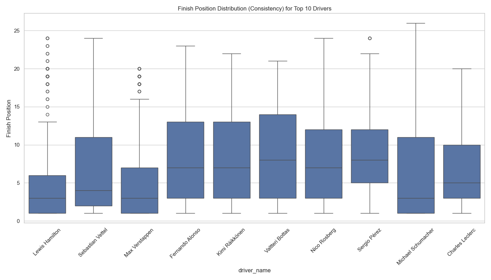
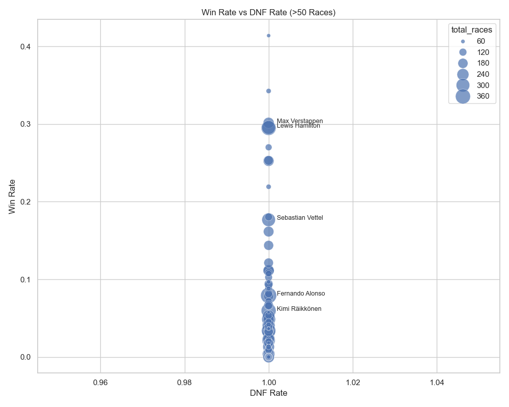
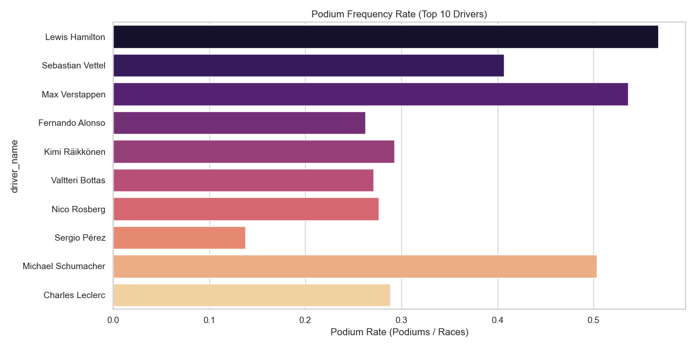

# F1 Driver Performance Intelligence Report

## Overview
This report analyzes driver performance across F1 history (1950-2020 dataset), creating a comprehensive view of wins, consistency, and reliability.

## 1. Top Performers (Career Points)
The following drivers have accumulated the most points in their careers (among those with >50 races):

| Driver | Races | Total Points | Wins | Podiums |
| :--- | :--- | :--- | :--- | :--- |
| Lewis Hamilton | 356 | 4820.5 | 105 | 202 |
| Sebastian Vettel | 300 | 3098.0 | 53 | 122 |
| Max Verstappen | 209 | 2912.5 | 63 | 112 |
| Fernando Alonso | 404 | 2329.0 | 32 | 106 |
| Kimi Räikkönen | 352 | 1873.0 | 21 | 103 |

## 2. Consistency Analysis
Consistency is measured by the standard deviation of finishing positions. Lower score = More consistent.

| Driver | Races | Consistency Score | Avg Finish | DNF Rate |
| :--- | :--- | :--- | :--- | :--- |
| Nicholas Latifi | 61 | 2.80 | 15.9 | 100.00% |
| Antonio Giovinazzi | 62 | 2.97 | 13.9 | 100.00% |
| Guanyu Zhou | 68 | 3.08 | 14.6 | 100.00% |
| Esteban Gutiérrez | 59 | 3.33 | 15.1 | 100.00% |
| Marcus Ericsson | 97 | 3.38 | 15.0 | 100.00% |

## 3. Win Efficiency
Drivers with the highest conversion rate of race starts to wins (>50 races):

| Driver | Win Rate | Wins | Races | Points/Race |
| :--- | :--- | :--- | :--- | :--- |
| Juan Fangio | 41.38% | 24 | 58 | 4.81 |
| Jim Clark | 34.25% | 25 | 73 | 3.75 |
| Max Verstappen | 30.14% | 63 | 209 | 13.94 |
| Michael Schumacher | 29.55% | 91 | 308 | 5.08 |
| Lewis Hamilton | 29.49% | 105 | 356 | 13.54 |

## 4. Visualizations

### Career Points Leaders

### Consistency Profile
The boxplot shows the spread of finishing positions. A tighter box indicates higher consistency.

### Reliability vs Success
Mapping DNF rates against Win rates to see the tradeoff between aggression/reliability and victory.

### Podium Frequency
Percentage of races finished on the podium.

