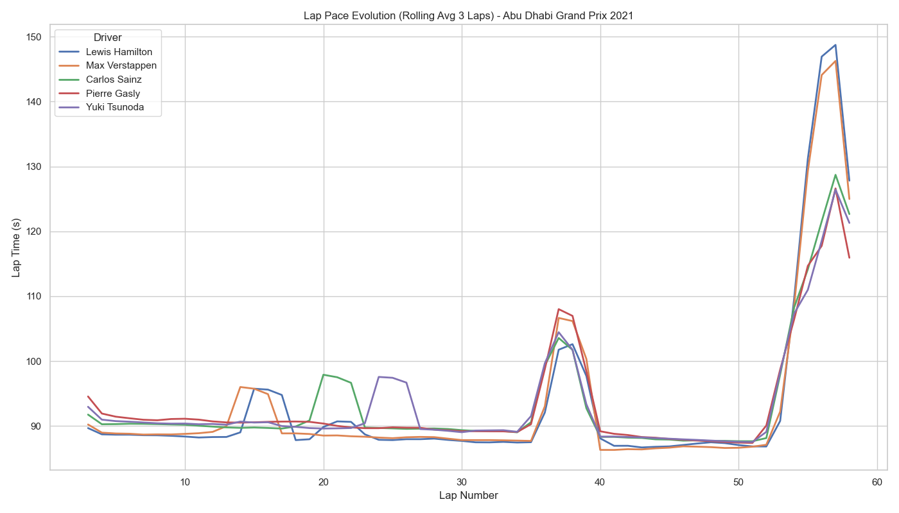

# F1 Strategy & Championship Intelligence Report

## Overview
This report analyzes advanced race dynamics, including lap pace evolution, pit crew performance, and circuit characteristics.

## 1. Pit Stop Performance (Hybrid Era 2014-2020)
Analysis of pit stop durations reveals the operational efficiency of teams.

## 2. Circuit Intelligence
Top circuits ranked by average position changes (overtaking potential). High variance tracks offer more strategic opportunities.

## 3. Championship Dynamics (Case Study: 2021)
The visible tightening of the points gap between contenders throughout the season.

## 4. Lap Pace Analysis
Rolling average lap times for the selected race showcase tire degradation and stint pace.

